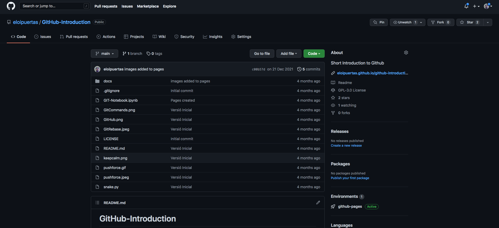
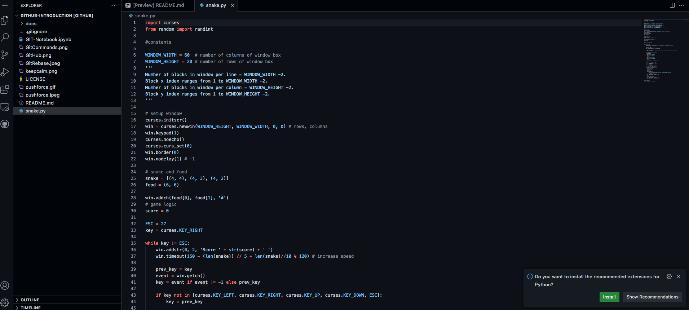
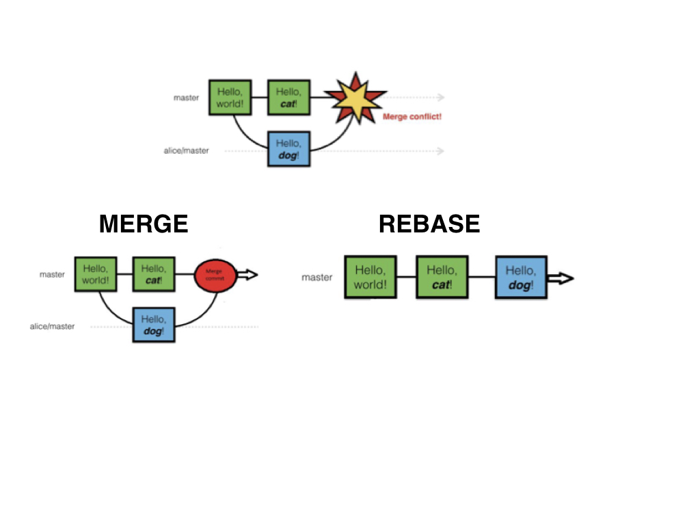

Version Control with Git
========================
<center>

</center>
<H3> <p align="left">  Eloi Puertas i Prats </p> </H3>

Version control also known as Revision control, source control is the
**management of changes to documents, programs, and other information stored as computer files.**

They are used in virtually all software development and in all environments, by everyone and everywhere VCS can used on almost any digital content, so it is not only restricted to software development, and is also very useful for manuscript files, figures, data and notebooks!

Without a VCS, it happens situations like these:


"Piled Higher and Deeper" by Jorge Cham, http://www.phdcomics.com


"Piled Higher and Deeper" by Jorge Cham, http://www.phdcomics.com

There are two main purposes of VCS systems:

1. Keep track of changes in the source code.
    * Allow reverting back to an older revision if something goes wrong.
    * Work on several "branches" of the software concurrently.
    * Tags revisions to keep track of which version of the software that was used for what (for example, "release-1.0")
2. Make it possible for serveral people to collaboratively work on the same code base simultaneously.
    * Allow many authors to make changes to the code.
    * Clearly communicating and visualizing changes in the code base to everyone involved.

### Basic Terminology

In an VCS, the source code or digital content is stored in a **repository**. 

* The repository does not only contain the latest version of all files, but the complete history of all changes to the files since they were added to the repository. 

* A user can **checkout** the repository, and obtain a local working copy of the files. All changes are made to the files in the local working directory, where files can be added, removed and updated. 

* When a task has been completed, the changes to the local files are **commited** (saved to the repository).

* If someone else has been making changes to the same files, a **conflict** can occur. In many cases conflicts can be **resolved** automatically by the system, but in some cases we might manually have to **merge** different changes together.

* It is often useful to create a new **branch** in a repository, or a **fork** or **clone** of an entire repository, when we doing larger experimental development. The main branch in a repository is called often **master** or **trunk**. When work on a branch or fork is completed, it can be merged in to the master branch/repository.

### Client-Server VCS
In Client-Server VCS the **repository** is hosted by a server. A client program is used for managing versions of the local working copy 

The most important client-server open-source VCS are:

* CVS  ([Concurrent Version System](http://www.nongnu.org/cvs/))
* SVN  ([Subversion](http://subversion.apache.org/)) 

### Distributed VCS
In Distrubutd VCS code is shared by different **repositories**. In general, it exists a local repository along the local working copy, and a remote repository for collaborating. 

With distributed VCS we can **pull** and **push** changesets between different repositories. For example, between the local copy of the repository to a central online reposistory (for example on a community repository host site like github.com).

The most important distributed open-source VCS are:

* [Git](http://git-scm.com/)
* [Mercurial](http://mercurial.selenic.com/)


## Working with a distant repository 

With a hosted repository it easy to collaborate with colleagues on the same code base, and you get a graphical user interface where you can browse the code and look at commit logs, track issues etc.

Some good hosted repositories are

* [Github](http://www.github.com)
* [Bitbucket](http://www.bitbucket.org)

Github.com is a web hosting plateform for git projects. It provide free git repository for opensource projects (private ones can be purchased, or asked for free for [students](https://education.github.com/discount_requests/new)) as well as it provides great tools to review code, manage projects, release packages and publish documentation. Most of the scientific python code you will use in this course are hosted on github.

Bitbucket.com provides unlimited private code repositories for free for teams up to 5 developers

There are also a number of graphical users interfaces for GIT. The available options vary a little bit from platform to platform:

* [http://git-scm.com/downloads/guis](http://git-scm.com/downloads/guis)

If you preffer, you can use the command line:

    git


Now, let’s go on github.com, and create an account:

[https://github.com/join](https://github.com/join)

Once this is done, we can easily create a new project by cliking on the green button, on the main page:

[https://github.com/new](https://github.com/join)

Github redirects you to a page, where you specify the name of the repository and a few information. By default, git repositories hosted on github will be public. 
Github then displays a page with a url, and some information on how to proceed to configure your local repository. Note that if you decide to create a README file, a Licence or a .gitignore on github, it will automatically commit.

**Hands On**

Create a Repository called `Github-Introduction` in your github account

First, we have to **clone** the remote repository.
The name of the repository can be found at the right part of the screen:



### Using desktop client

You can **clone** the repository through you Github Desktop client by clicking in button `Clone in Desktop`

Next, your Github Desktop will open. You will be asked for what directory you want to clone the repository. Then the Github Desktop will open. 

From now on, all changes to this repository will be shown in the `Changes` tab. 

### Using command line

Just type:

    git clone <https://github.com/name of repository>
    
The first time you will use the git command line you should configure a personal access token:

[https://docs.github.com/en/authentication/keeping-your-account-and-data-secure/creating-a-personal-access-token](https://docs.github.com/en/authentication/keeping-your-account-and-data-secure/creating-a-personal-access-token)


**Hands On**

Download the [snake.py](snake.py) file. Put this file in a directory called `src` inside your `Github-Introduction` repository 

### Using desktop client:
Now you can observe that exists changes in your local copy. The first thing to do, is add this document to the Local Repository. In your Desktop client it would by tagged as New. Now write a comment on the `Summary` text area  and commit the changes to your **Local** repository. This can be done by pressing the `commit` button.
### Using command line:
You can observe that exists changes in your local copy using

    git status
The first thing to do, is add this document for tracking. Type

    git add <archive>
Next is to commit changes to your Local Repository using

    git commit -m "Some informative message" <archive>


The changes have not been upload to remote repostitory yet. If you check your repository on github.com, you'll see that the changes are not present. To do this you need to `push` your changes. 


### Using desktop client:

In the menu `Repository` select `Push` option. Now the changes are published to the remote repository

### Using command line:

Type:

    git push
Now the changes are published to the remote repository

### Using IDE's as GITHUB clients.

 You can use any IDEs as Github client since all of them have integration with git. Just clone the repository to a local directory and create or open an existing project in the repository. 
 Github has a web editor integrated based on visual studio. Just press the '.' (dot) key in any repository and the web editor will be opened (or just change github.com/ by github.dev in the beggining of URL repository web page). 
 
 
 
 
 
 **Hands On**

Set up the `Github-Introduction` repository in any of your IDE's you are using now.  

### Forking 
Sometimes you don't need to create a new repository from the scratch. You can fork a repository from another existing. From this moment you can change your forked repository without affecting the original one. Even, if you want, you can synchronize again your repository with the original one to get any new updatedes. 
For forking just press the Fork button on top right screen in any repository and put the name you prefer for your forked repository. 

**Hands On**

Fork the `eloipuertas/Github-Introduction` repository in your github account.


## Further things in Github

* Watch. You can be notified when changes happen in a repository. It is useful when working together in the same repository 
* Star. You can mark a repository as a favorite. 
* GitHub pages. You can create your own web page, just go to *pages* menu inside *settings* tab and select the directory in your repository where your html pages are. 
* Issues. You can create tasks so you can organize your work and commits, assign them to people, write down documentation and tests, etc...
* Project. You can create a project to visualize your tasks and track its status, todo, work in progress, done
* Wiki. You can create a Wiki to document your work and share with your collegues. 
* Insights. Give you information about how many commits, traffic, branches and more information had happen in your repository. 
* Actions. You can create authomated workflows for your repository, for example execute tests after a commit happens, deploy the code to a cloud service...
   


### Collaborating

**Hands On**

Now we're going to form teams of two people. One of the members of the group will add the other github user to his/her repository. To do this go to `Settings` tab and add your other team members using Collaborators option. 

Now follow the next steps:
* If you are not the owner of the repository, clone your friend `Github-Introduction` Repository
* Both of you go to `Github-Introduction` and open the copy of this document. 
* Add new text on the beggining of the file
* Commit changes.
* Push changes.

What happens ?


`Pull` the repository to update the changes in your local repositories. (In desktop client,  in the menu `Repository` select `Pull` option) (In command line: `git pull`)

It have ocurred any **conflict**?
If it does,
* Revise `history` tab to see the different updates of the repository. Who made what. (In command line: `git log`)
* See the differences between yor working tree and last version on your Local Repository. (In command line: `git diff`)
* Revert your changes, or resolve and commit it. 
    * Revert changes: 
        * Restore working directory file: `git checkout -- <file>`
        * Revert add file, before commit: `git reset -- <file>`
        * Revert last commit without changing working tree: `git reset --soft HEAD~1`
        * (Warning!) Revert last commit changing working tree: `git reset --hard HEAD~1`
    * Resolve conflict:
        * Merge: (Warning!) it makes a "bridge" commit, with differences of both versions. The code will be modified and will not work until someone clean it.
        * Rebase: it applies *Your* changes in the remote repository, after last commit. Rebasing re-writes the project history by creating brand new commits for each commit in the original branch. `git rebase -i master` makes rebasing interactive, so you can see which commits will be created. The golden rule of git rebase is to never use it on shared branches.
    


        
   

      
### What kind of conflicts may exist?

* Two people are editing the same file:
    * If editing takes place in different parts of file, git can resolve automatically.
    * else, it must to be handled manually.  To complete this type of merge, use your text editor to resolve the conflict, then add the file and commit it to complete the merge.
    
* A file has been removed while you were editing it. 
    * It has to be pushed again or removed from your working directory. You can resolve this by adding the file back, and committing it once more. On the other hand you can resolve it by removing the file completely, so do that with the `git rm`.


* A Binary file changed remotely and locally.
    * One of two versions have to be accepted. 
    


Now do the same thing but using the notebook file instead of the python file. Upload your version of notebook, and the rest of the group change it, putting news cells with comments and avalauation.

* It have ocurred any **conflict**? If it does, resolve them.

You can see in the github repository how your collaborative notebook looks like.

### Tips for Collaborative coding:

* If there is a conflict, talk with last person that change the file, and decides which changes are valids.

* Work in one file at same time and commit very frequently.

* When conflicts Keep Calm and Ask for Help


* **NEVER EVER** git push --force


* <H3> Use feature branching


### Branches
* You can keep stable code in one branch (master) and develop in other branches.
* Reduce the number of conflicts, while developing.

How to build a branch:
* `git branch <branch_name>`

How to change to an other branch:
* `git checkout <branch_name>`

How to do the above two together:
* `git checkout -b <branch_name>`

How to delete a branch:
* `git branch -d <branch_name>`

How to change the name of a branch:
* `git branch -m <new_branch_name>`

How to merge a branch to the current branch:

* `git merge <branch_to_merge>`


### Steps for feature branching

1. Create new branch for the specific feature and change to it:
            git checkout -b add_start_button

2. Work in this branch until the end of implementation and testing.
3. Merge branch to dev: 
            git merge dev
4. Fix merge conflicts.

    

## Working with a local repository


You can create a local repository in your machine instead of using a distant repository.
In the GitHub Desktop client press the `+` symbol and go to the `Create` tab. It ask you for a repository name and the local path. Once create it you can commit new versions.

**Hands On**

* create a new remote Repository called gitdemo and edit the README file so it explains the purpose of the repository

* create a local clone of th repository (use the big green button on the top right of github to get the URL)

* In your local clone of the repository, open this file (README.md). At the top of the file, underneath the title, type: "I'm [your name] and I edited this file!"

* Check the status. You'll need to add the changes to this file and commit. Make sure you give a proper description of the changes.

* Our primary remaining task is to push our code back to GitHub. 

* Go to GitHub and check that your changes are now in GitHub as well

* Now make a change on the README file from GitHub

* Pull the latest version of the file to your local repo. 


```python

```
